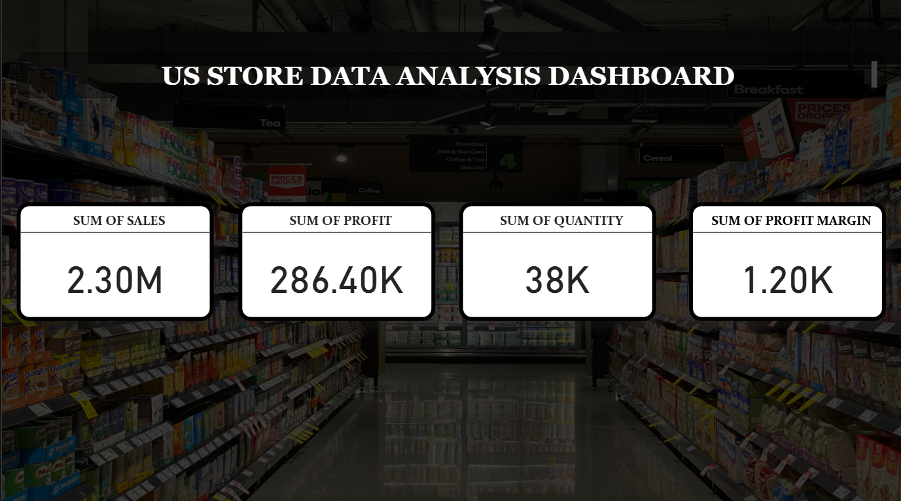
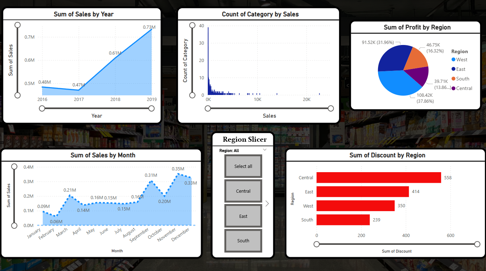
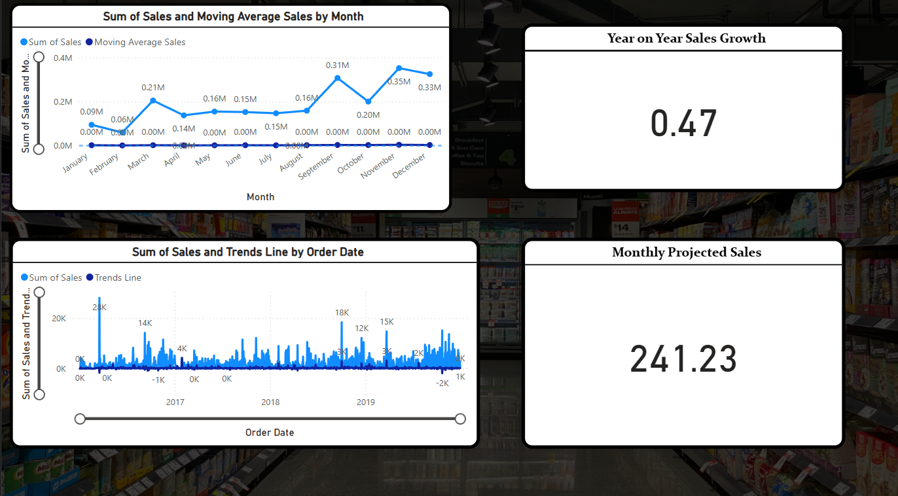
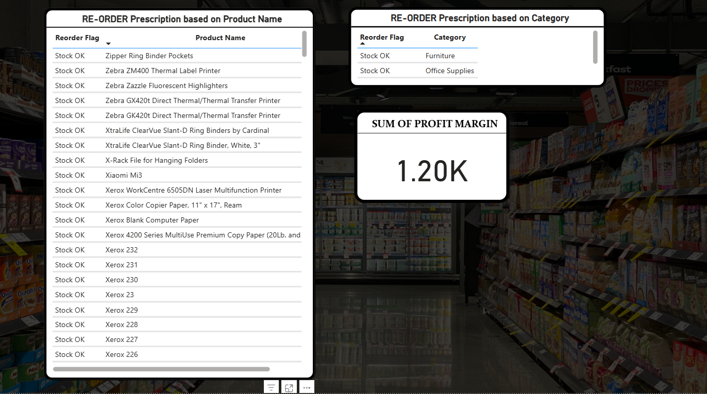

# Power BI Dashboard – US Store Data Analysis

## Overview

This project presents a comprehensive Power BI dashboard for analyzing US Store data, covering **Descriptive**, **Diagnostic**, **Predictive**, and **Prescriptive Analytics** to provide data-driven insights and recommendations.

---

## 1. Descriptive Analytics

### Objective

Summarize historical data and provide an overview of key business metrics.

### Steps Performed

* Imported and cleaned US Store data in Power BI.
* Created visual KPIs for:

  * Total Sales
  * Total Profit
  * Total Quantity Sold
  * Total Discounts
* Designed interactive charts:

  * Sales by Category and Sub-Category
  * Profit by Region and State
  * Monthly Sales Trend
  * Top and Bottom Performing Products
* Added slicers for dynamic filtering by region, category, and year.

---

## 2. Diagnostic Analytics

### Objective

Understand reasons behind trends, variations, and performance gaps.

### Steps Performed

* Drill-down analysis to identify **profit and sales variations** by:

  * Product Sub-Category
  * Region and State
  * Customer Segments
* Created detailed tables to show contribution to profit or loss.
* Analyzed discount impact on profitability using interactive visuals.

---

## 3. Predictive Analytics

### Objective

Estimate future trends based on historical performance.

### Steps Performed

* Derived a sequential **Day Number** field to track order progression.
* Built a trendline visualization to project future sales performance.
* Used historical trends to estimate future demand patterns for products and categories.
* Created visual indicators for potential future growth areas.

---

## 4. Prescriptive Analytics

### Objective

Provide actionable recommendations for decision-making.

### Steps Performed

* **Reorder Flag for Low Stock**

  * Flagged products with low sales quantities to recommend reordering.
* **Return Rate Analysis**

  * Highlighted products with high return rates for review.
* **Profitability Recommendations**

  * Identified low-profit items and suggested corrective actions.
* Applied **conditional formatting**:

  * Products with high return rates were highlighted in red.
  * Products with low profitability were flagged for attention.
* Suggested operational actions:

  * Stock replenishment.
  * Discount optimization.
  * Profitability-focused marketing strategies.

---
## Snapshots

## Key Insights

* Certain sub-categories and regions drive the highest profits.
* Discount-heavy products often lead to lower margins.
* High return rate products indicate quality or fulfillment issues.
* Profitability recommendations help focus on improving overall margins.

---

## Tools Used

* **Microsoft Power BI** – Data visualization and analytics.
* **Power Query Editor** – Data transformation and cleaning.
* **Interactive Visuals & KPIs** – For intuitive insights.

---

## Outcome

The dashboard provides a **complete analytical view** of US Store data, guiding stakeholders with clear insights and recommendations for **sales growth**, **profit improvement**, and **operational efficiency**.

