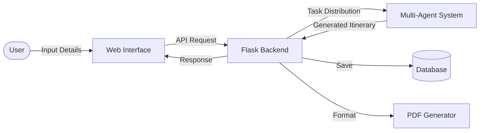
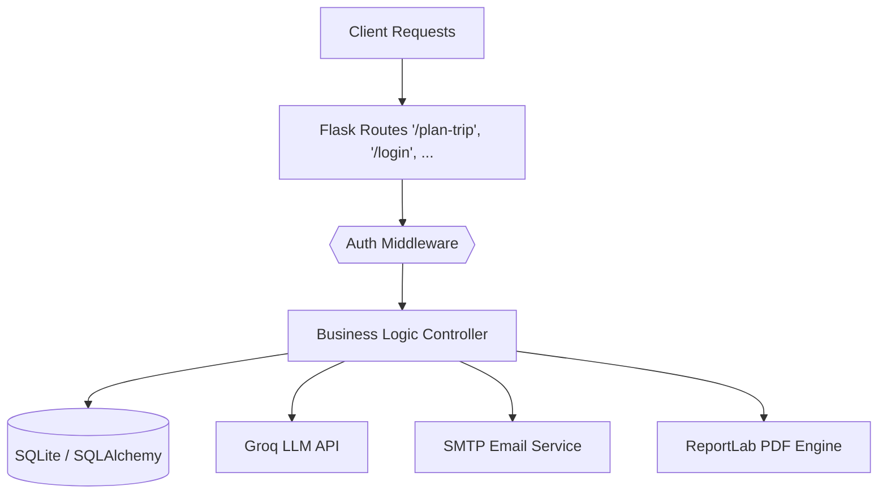
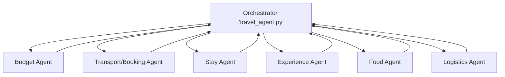
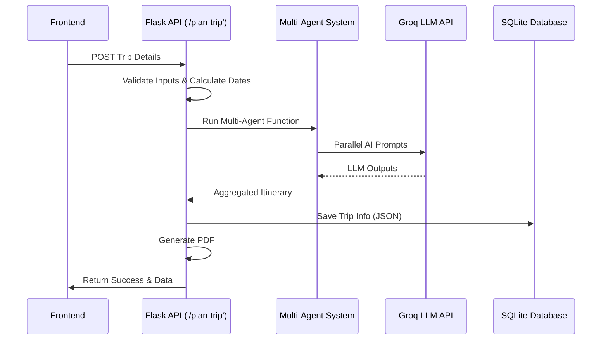
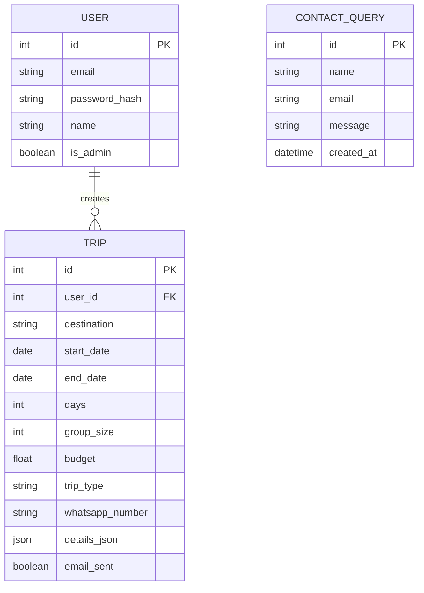

# TripTacticX Presentation Outline

## Slide 1: Title Slide
TripTacticX: AI-Powered Travel Planner
Multi-Agent System with Intelligent Backend Architecture

Name
Course / College
Data Analytics Apprentice @ Target

---

## Slide 2: Problem Statement
* Travel planning is fragmented across multiple platforms
* Requires handling budget, transport, stay, and activities separately
* No centralized system for intelligent decision-making
* Leads to inefficient and time-consuming planning

---

## Slide 3: Proposed Solution
* AI-powered web application for travel planning
* Generates complete itinerary based on user input
* Uses multi-agent architecture for task distribution
* Provides structured and optimized travel plans

---

## Slide 4: System Overview
* User interacts via web interface
* Backend processes input and triggers AI system
* Multi-agent system generates itinerary
* Data stored in database
* Output displayed and exported as PDF

---

## Slide 5: Technical Stack
* Frontend: HTML, CSS, JavaScript
* Backend: Flask (Python REST API)
* Database: SQLite with SQLAlchemy ORM
* Authentication: Flask-Login (session-based)
* AI Engine: Groq API (LLaMA 3 models)

---

## Slide 6: Backend Architecture
* Flask server handles API routes and business logic
* Modular structure with separate agents and models
* RESTful endpoints for trip planning, chatbot, and admin
* Middleware handles authentication and session control
* Integration with external APIs (Groq, SMTP)

---

## Slide 7: Multi-Agent System (Core Innovation)
* Central orchestrator manages multiple AI agents
* Each agent performs a specific task
* Tasks include: Budget allocation, Transport planning, Stay recommendations, Activity planning, Food suggestions, Logistics
* Improves modularity and reduces AI hallucination

---

## Slide 8: Orchestrator Logic
* Receives user inputs (destination, budget, dates, preferences)
* Converts inputs into structured prompts
* Calculates group and per-person budgets
* Distributes tasks to respective agents
* Aggregates responses into final itinerary

---

## Slide 9: Budget Allocation System
* Converts per-person budget into total group budget
* Splits budget across categories: Stay, Transport, Food, Experiences
* Provides constraint-based input to agents
* Ensures realistic and optimized planning

---

## Slide 10: Prompt Engineering
* Each agent receives a customized prompt
* Prompts include: Budget constraints, Trip duration, User preferences, Group size
* Ensures structured and relevant AI outputs
* Reduces ambiguity in LLM responses

---

## Slide 11: Data Flow (End-to-End)
* User submits trip details via frontend
* Request sent to Flask API (/plan-trip)
* Backend validates and processes input
* Multi-agent system generates responses
* Data stored in database (JSON format)
* Results returned to frontend

---

## Slide 12: Database Design
* SQLite database with SQLAlchemy ORM
* Entities: User (authentication data), Trip (itinerary and preferences), ContactQuery (user messages)
* JSON used to store structured agent outputs

---

## Slide 13: PDF Generation System
* Uses ReportLab for dynamic PDF creation
* Generates structured itinerary document
* Uses in-memory buffer (BytesIO)
* Avoids disk storage for efficiency
* Enables fast and scalable document generation

---

## Slide 14: Email Integration
* Uses SMTP protocol for email delivery
* Sends itinerary PDF to user
* Secure credentials via environment variables
* Includes error handling and fallback

---

## Slide 15: AI Chatbot – Compass
* Built using Groq LLM API
* Uses system prompts to define behavior
* Provides short, contextual travel suggestions
* Maintains conversational flow

---

## Slide 16: Recommendation Engine
* Generates top 5 destinations
* Uses structured JSON output from LLM
* Based on: Travel date, Trip type
* Ensures clean UI rendering

---

## Slide 17: Admin Dashboard
* View all users and trips
* Monitor email delivery status
* Access user queries
* Role-based access control implemented

---

## Slide 18: Challenges Faced
* Coordinating multiple AI agents
* Managing structured LLM outputs
* Handling budget constraints effectively
* Ensuring system performance and reliability

---

## Slide 19: Future Scope
* Integration with real-time booking APIs
* Upgrade to scalable database (PostgreSQL)
* Collaborative trip planning
* Integration with maps and live data
